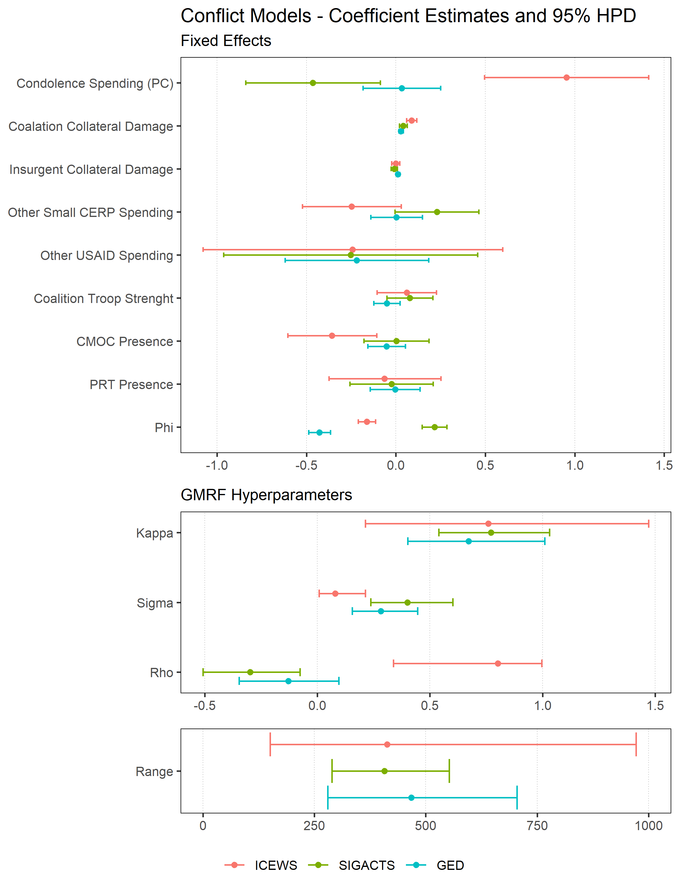
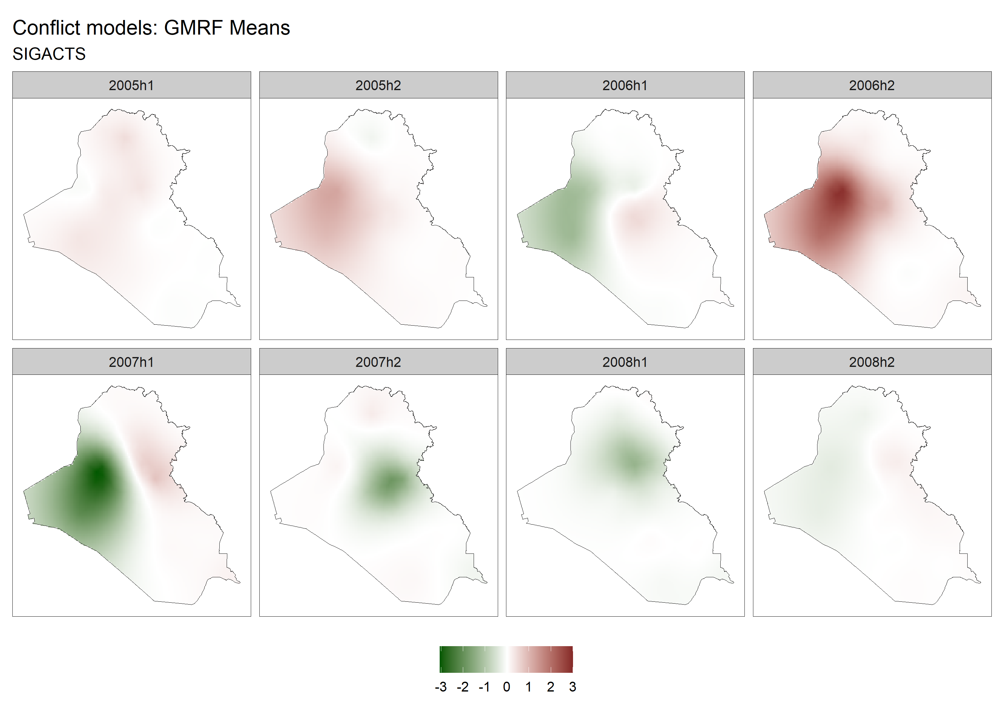

```{r setup, include=FALSE}
knitr::opts_chunk$set(echo = FALSE, message = FALSE, warning = FALSE)

# load("writeup.Rdata")

library(kableExtra)
library(dplyr)
# library(skimr)

source("../../scripts/fn_inla-table.R")
load("../../data/Oxford_HB_2021_APSA-Data.Rdata")
load("../../Results/Estimates/estimate-table-params.Rdata")


dat <- irq_halfyr %>%
  rename(
    SIGACTS   = p_s1_d,
    # sigacts_l = p_s1_d_lag,
    ICEWS     = p_icews_d,
    # icews_l   = p_icews_d_lag,
    GED       = p_ged_d
    # ged_l     = p_ged_d_lag
  ) %>% dplyr::select(SIGACTS, ICEWS, GED)
rm(irq_halfyr, irq_month, sp_wts, irq)
```

<!-- NEED: prior information!!! -->

# Document overview:

This memo provides the following: A table of model estimates, a coefficient plot for one set of models, mapped GMRF field prediction for this same set of models.

There are two types of models here: "Conflict" and "Bias". The conflict models replicate the final model that Silverman presented in Table 2 of his paper but omit unit, time, and Sunni-vote-share fixed effects. Instead these models include a temporal lag of the dependent variable on the right hand side (I call `Phi`) as well as a spatio-temporal GMRF - the temporal dependence between fields over time is captured by the parameter `Rho` in the hyperparameter section of the Table and Coefficient Plot (Figure 1)

The "Bias" models are almost identical to the conflict models with two differences. I remove the temporal lag on the dependent variable and add the contemporaneous measure of SIGACTS to the right-hand-side. My intuition here was that, after controlling for ground-truth, none of the remaining control variables should have been reliable predictors of ICEWS or GED events. I also though the parameters on SIGACTS would be indicative of overreporting ($\beta_{SIGACTS}>1$) or underreporting ($\beta_{SIGACTS}<1$). So, I was really surprised to discover that ground-truth provides no predictive power to explain variation in reported ICEWS or GED events. This remains the case even when I exclude all the controls and seems to indicate that ICEWS and GED have a different underlying data generating process or are capturing different events (or simply missing too many events) relative to SIGACTS. Since all three measures have similar overall distributions (variable summary statistics in nearby table) this also may indicate they are locating events in different Iraqi districts.

```{r, results='asis', eval = FALSE}
library(texreg)
m1 <- lm(ICEWS ~ SIGACTS, data = dat)
m2 <- lm(GED   ~ SIGACTS, data = dat)

knitreg(list(m1,m2))
```

```{r}
# skim(dat) %>% 
#   as.data.frame %>% 
#   dplyr::select(skim_variable, numeric.mean, numeric.sd)

d <- bind_rows(
  c("Mean" = mean(dat$SIGACTS), 
    "SD"   = sd(dat$SIGACTS), 
    "Min." = min(dat$SIGACTS),
    "Max." = max(dat$SIGACTS)),
  
  c("Mean" = mean(dat$ICEWS), 
    "SD"   = sd(dat$ICEWS), 
    "Min." = min(dat$ICEWS),
    "Max." = max(dat$ICEWS)),
  
  c("Mean" = mean(dat$GED), 
    "SD"   = sd(dat$GED), 
    "Min." = min(dat$GED),
    "Max." = max(dat$GED))
  ) %>% as.data.frame

rownames(d) <- c("SIGACTS","ICEWS","GED")

d %>% 
  kbl(., 
      digits    = 3, 
      caption   = "Summary Statistics",
      col.names = c("Mean","St. Dev.", "Min.","Max."),
      align     = c("l","c","c","c","c"),
      booktabs  = TRUE) %>% 
  kable_styling(full_width = TRUE)
```


## Conflict models

Overall, there is a lot of noise in these models. The credibility intervals on parameters for many of the included variables are wide and span zero. Silverman's main variable of interest - `Condolence Spending per capita` - has an almost identical estimate here. In Silverman's model (95% CI based on his reported standard errors): -0.52 [-0.89, -0.15] and in the spatio-temporal SPDE model without Silverman's Fixed Effects but with a first-order lag on the DV added to the right-hand side: -0.46 [-0.84, -0.09].

Looking at the ICEWS and GED models paint a different picture for Condolence Spending. ICEWS suggests the opposite conclusion relative to the SIGACTS model: that condolence spending reliably leads to more violence while GED suggests that condolence spending has no effect on violence. The difference in these measures of violent events also extends to the dynamics implied by the temporal lags on the dependent variables (`Phi`) illustrating different underlying processes for ICEWS and GED relative to SIGACTS. SIGACTS exhibits clear positive temporal autocorrelation while ICWES and GED are both negative. 


## INLA GMRF Prediction

It seems that there is potential to specify covariate values to construct GMRF predictions. It struck me that this could be a useful way to construct counterfactual analysis further and illustrate the value of SPDE models above the static FE models. It could also provide a useful way to connect the SPDE models to the STAR models more explicitly, but I need to experiment with the code more.


\begin{landscape}
```{r}
inla_table(params      = params, 
           header      = c(" " = 1, "Conflict" = 3, "Bias" = 2),
           model_names = c(" ","SIGACTS", rep(c("ICEWS","GED"),2)),
           caption     = "SPDE Model Results")
```
\end{landscape}


```{r, fig.cap = "Conflict models - estimates"}

```


```{r image, echo = FALSE, fig.cap = "SIGACTS GMRF Mean", fig.align= "center", results = "asis", fig.show='hold', out.width = "9in", fig.pos = "H",out.extra='angle=90', eval = FALSE}

```

\begin{landscape}
\begin{figure}
  \centering
  \includegraphics[width=9in,height=6.5in]{"../../Results/Figures/figure-field-sigacts.png"}
  \caption{SIGACTS GMRF Mean}
\end{figure}
\end{landscape}


\begin{landscape}
\begin{figure}
  \centering
  \includegraphics[width=9in,height=6.5in]{"../../Results/Figures/figure-field-icews.png"}
  \caption{ICEWS GMRF Mean}
\end{figure}
\end{landscape}


\begin{landscape}
\begin{figure}
  \centering
  \includegraphics[width=9in,height=6.5in]{"../../Results/Figures/figure-field-ged.png"}
  \caption{GED GMRF Mean}
\end{figure}
\end{landscape}
