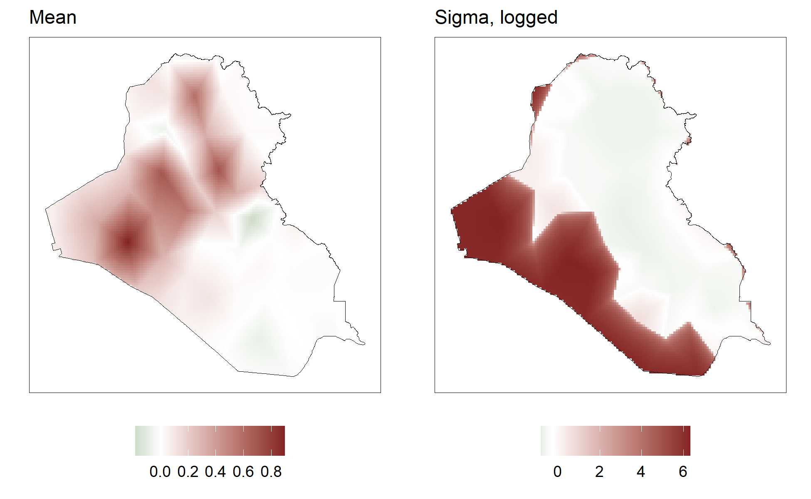

```{r setup, include=FALSE}
knitr::opts_chunk$set(echo = FALSE, message = FALSE, warning = FALSE)


library(texreg)
load("../../Results/Estimates/results-apsa.Rdata")
```

### Priors
Mesh - the mesh used here contains 126 nodes (constrained to limit computation times). The mesh isn't really a prior since it only really impacts estimate precision.

For the SPDE I employed penalized complexity priors on a Matern Model where I assign a 10% probability that:   

* the range is above 3.6 (approximately 332 km at Iraq's latitude) $(3.6,\ 0.1)$
* the standard deviation is above 1                                $(1,\ 0.1)$

The range prior accounts for the majority of violence occurring within Baghdad during this time period and thus the scale of the spatial process implied by the sample of data analyzed here. Baghdad's average distance from its nearest international border is approximately 332 km which, at Iraq's latitude, corresponds to 3.6 decimal degrees. This prior therefore assigns a small probability that the spatial effects implied by the GRMF extends beyond this range.

On the GMRF random walk I follow Python and the recommendations of R-INLA and employ a penalized complexity prior for the variance of the temporal structure $(\sigma_{rw}^2)$ with probability that variance exceeds 1 is 1%. 

Finally, for the fixed effects (independent regressors) I used R-INLA defaults priors of i.i.d. normal distributions of mean 0 and precision 0.001.


### Models
In the table below Columns 1 and 2 replicate Silverman's IO model from Column 4 in Table 2 on page 866. The first column is an exact replication (for consistency I present confidence intervals for all models rather than any standard errors) and thus uses the same setup as the IO article: drop Baghdad (Karkh district) and use population based analytic weights. The second column preserves these choices but drops the first year of observations associated with the DV-lag used in a few subsequent models.

Columns 3 and 4 present the spatio-temporal lag model estimates with the structural from estimates presented in column 3 and the long-run-steady-state equilibrium estimates presented in table 4. These correspond to eq. 2 in the most current version of the paper.

Finally, I present two SPDE models in column 5 and 6 with the model in column 5 retaining the DV temporal lag on the DV used in the STAR model and the model in column 6 dropping the temporal lag on the DV. Relative to Silverman's published model from the first column, neither of the spending variables retain reliably non-zero parameter estimates in the GRMF model when the temporal lag on the DV is not included.

### Ruzicka spending
The Ruzicka spending variable exhibits a great deal of instability which I attribute to the lack of variance for this measure: 84% of the observations in the half-year sample used here are zero.


\begin{landscape}
```{r, results='asis'}

tmp <- mod_tex[!names(mod_tex) %in% c("m3_star_lrss", "m4_2_spde")]

# knitreg(tmp,
#         omit.coef = "district_|time_|su_vh|Intercept",
#         custom.gof.rows = list("FE: District" = c("Yes", "Yes",
#                                                   "No", "No", "No"),
#                                "FE: Time"     = c("Yes", "Yes",
#                                                   "No", "No", "No"),
#                                "FE: Sunni VS" = c("Yes", "Yes",
#                                                   "No", "No", "No")),
#         custom.coef.map = list(
#   "p_spentcptotal_d"          = "Condolence Spending (PC)",
#   "p_spentruzicka_d"          = "Ruzicka Spending (PC)",
#   "coalitioncc_d"             = "Coalition Collateral Damage",
#   "insurgentcc_d"             = "Insurgent Collateral Damage",
#   "p_spentcerpsmall_noncp_d"  = "Other Small CERP Spending",
#   "p_spentusaid_nonruzicka_d" = "Other USAID Spending",
#   "a_of_batt_d"               = "Coalition Troop Strength",
#   "cmoc"                      = "CMOC Presence",
#   "dis_usprt"                 = "PRT Presence",
#   "phi"                       = "Phi",
#   "rho"                       = "Rho",
#   "Kappa"                     = "Kappa",
#   "Sigma^2"                   = "Sigma^2",
#   "Range"                     = "Range"),
#   custom.header = list("Replication" = 1:2,
#                        "STAR"        = 3,
#                        "SPDE"        = 4:5),
#   custom.model.names = c("Published", "Case Subset",
#                          "STAR-Structural",
#                          "SPDE-DV Lag", "SPDE-No DV Lag"),
#   booktabs = TRUE,
#   fontsize = "footnotesize"
#   )

knitreg(tmp,
        omit.coef = "district_|time_|su_vh|Intercept",
        custom.gof.rows = list("FE: District" = c("Yes", "Yes",
                                                  "No", "No"),
                               "FE: Time"     = c("Yes", "Yes",
                                                  "No", "No"),
                               "FE: Sunni VS" = c("Yes", "Yes",
                                                  "No", "No")),
        custom.coef.map = list(
  "p_spentcptotal_d"          = "Condolence Spending (PC)",
  "p_spentruzicka_d"          = "Ruzicka Spending (PC)",
  "coalitioncc_d"             = "Coalition Collateral Damage",
  "insurgentcc_d"             = "Insurgent Collateral Damage",
  "p_spentcerpsmall_noncp_d"  = "Other Small CERP Spending",
  "p_spentusaid_nonruzicka_d" = "Other USAID Spending",
  "a_of_batt_d"               = "Coalition Troop Strength",
  "cmoc"                      = "CMOC Presence",
  "dis_usprt"                 = "PRT Presence",
  "phi"                       = "Phi",
  "rho"                       = "Rho",
  "Kappa"                     = "Kappa",
  "Sigma^2"                   = "Sigma^2",
  "Range"                     = "Range"),
  custom.header = list("Replication"    = 1:2,
                       "STAR"           = 3,
                       "Geostatistical" = 4),
  custom.model.names = c("Published", "Subset",
                         "STAR-Structural",
                         "SPDE"),
  booktabs = TRUE,
  fontsize = "footnotesize"
  )

```
\end{landscape}


### Gaussian Markov Random Fields
```{r, fig.cap = "Random Walk GMRF - Fields"}

```
